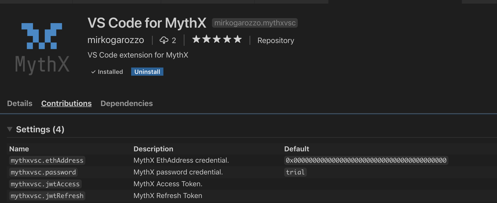
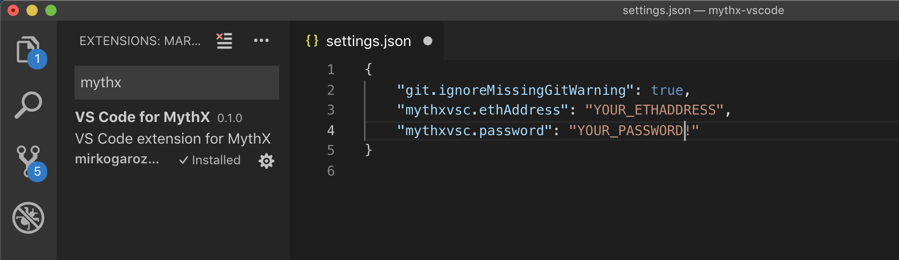
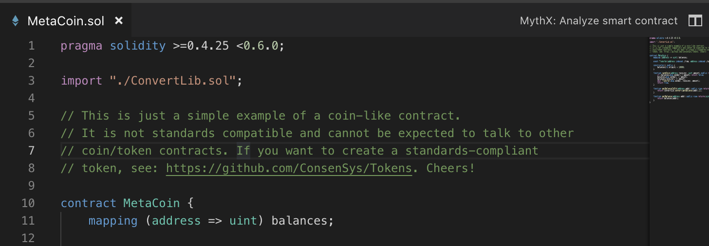
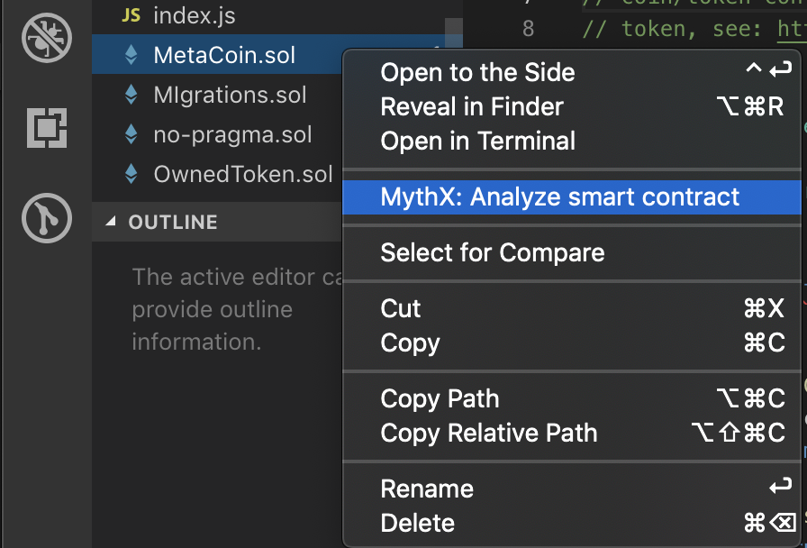
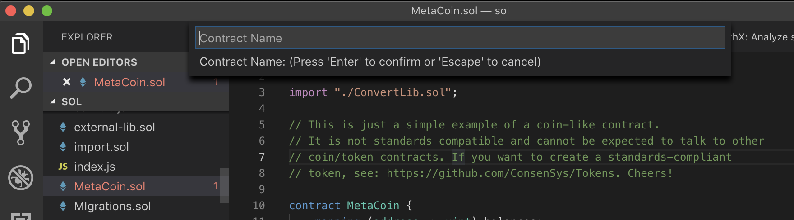

**Please note that the extension is still in beta version.**

MythXvsc is an extension for running MythX smart contract analysis from your favourite IDE.

The extensions provides:

-   Smart contract compilation (via `solidity` VSCode extension)
-   Log in to MythX platform
-   AST extraction from compiled source
-   Submission of analysis

## Instructions

After installing the extension please enter your registered MythX `ethAddress` and `password` in VSCode user settings. These fields are properties of `mythxvsc` as shown in the screenshots below:

**Please note that the credentials stored this way are exposed to VSCode. Be sure to understand the security risk this entails or contact the extension developers if you don't. We are working on a more robust log-in implementation.**

If no `ethAddress` and `password` provided the extension will fallback to use default trial credentials for MythX.

Now simply open a `.sol` file and click on the `MythX Analyze Smart Contract` button that you will see in the top right of your IDE window. Otherwise right click with your mouse on the contract name and you will see the Analyze command.

Once solidity compilation is done you will be prompted to enter the name of the contract you want to analyze. It is very important that you enter the correct name or the API will return an error and your analysis will fail, so it is reccomended to just copy and paste the contract name from the code.

Now you can just seat back and wait for MythX to do its magic :) Once analysis is over you will see your smart contract issues highlighted in your code. This should take no longer than three minutes.

## Dependencies

The MythXvsc extension depends on Juan Blanco [solidity extension](https://marketplace.visualstudio.com/items?itemName=JuanBlanco.solidity) and the Microsoft team [Azure Account extension](https://marketplace.visualstudio.com/items?itemName=ms-vscode.azure-account). Make sure you get both from Visual Studio Code Marketplace before installing MythXvsc.

## Known bugs

-   Analysis fails straight away on some contract. This is most likely caused by the API not digesting some input. Please contact the extension developer with a copy of the smart contract in order for us to investigate further.

## Features that will be implemented in the future

-   Logout from MythX
-   Full analysis mode
-   Multiple files submission
-   Detailed report

## Acknowledgements

-   Juan Blanco for helping out with solidity compiler.
-   Microsoft VSCode community.
