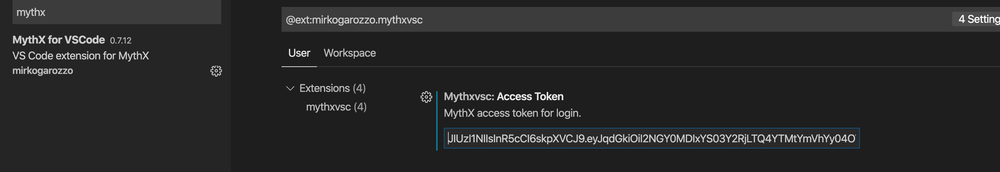
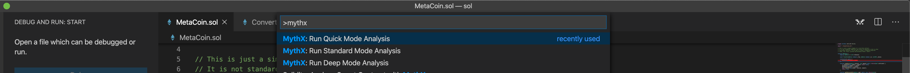
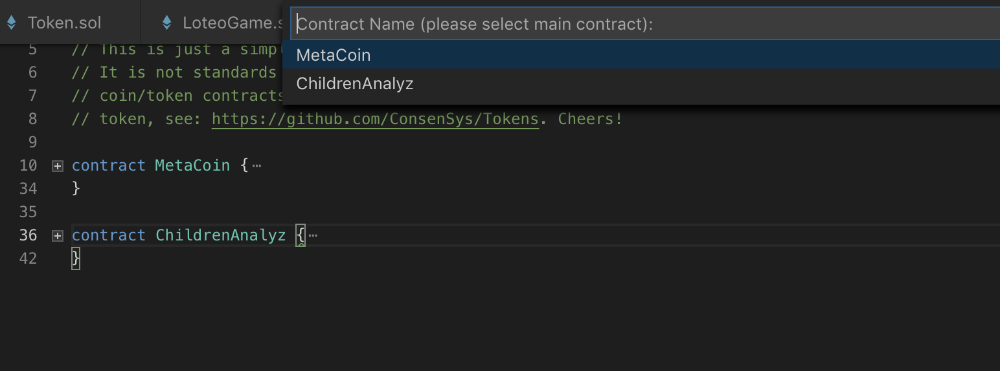
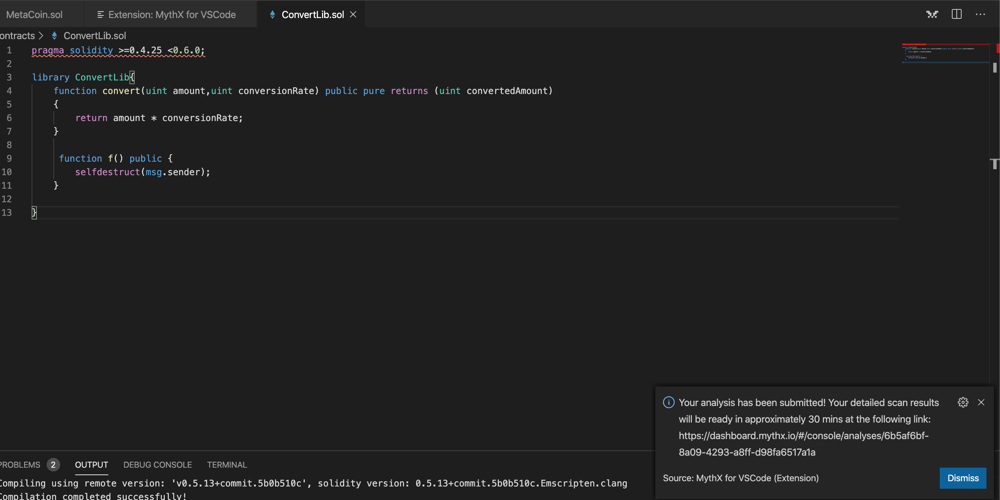

MythXvsc is an extension for running MythX smart contract analysis from Visual Studio Code.

The extensions provides:

-   Smart contract compilation (via the Solidity VS Code extension)
-   Authentication to the MythX platform
-   AST extraction from compiled source
-   Submission of analysis
-   Displaying analysis result in VS Code in a linting fashion

## Authentication

MythX uses an API key for authentication. Once your account is set up, head over to the [dashboard.mythx.io/](https://dashboard.mythx.io/). In the *Profile* section there is an element labeled `MythX API Key`. Generate a new API key by entering your account password:

On successful authentication, a new API key is generated, which can be used for further authentication by API clients. It will only be shown once, and can be copied using the icon on the right of the truncated secret string. If the token is lost, a new one can be generated again in the same way as explained above.

Copy the token and paste it in the Mythx extension user settings as shown below.

**Authentication via Ethereum address/Username and password is deprecated. Please note that the credentials stored this way are exposed to VS Code. Be sure to understand the security risk this entails or contact the extension developers if you don’t.**

# Usage

MythX give their users the ability to choose from three different scan options. This extension supports all three:

-   Quick analysis. This analysis will take up to 2 minutes. **This is the default functionality and also gives you linting formatting results in vscode. Just click on the MythX icon on the top right of the IDE window.**

-   Standard analysis. This will take up to 30 minutes.

-   Deep analyisis. This will take up to 90 minutes.

Refer to the [plans](https://mythx.io/plans/) page to see which plan you need for each mode. 

Once the solidity compilation is done, if there is only one contract in the solidity file you can just wait for analysis results. If there are multiple contracts in the same file you will be asked to pick a contract from a dropdown list of contracts that exist in the compiled AST. Please make sure to pick the main contract to avoid inconsistent results.

You will also get a popup window with a link to the dashboard that will take straight to your results, or if using quick mode you will see highlighted issues in your solidity code. The exact time it takes to perform an analysis will depend on the plan associated with your account.

**Please see the [MythX Pricing](https://mythx.io/plans/) page for details on plans.**

## Multiple file submission

This is a new feature of the extension that is currently being developed. Please stay alert on our twitter page for extra information on release date!

## Dependencies

The MythXvsc extension depends on Juan Blanco [solidity extension](https://marketplace.visualstudio.com/items?itemName=JuanBlanco.solidity). Make sure you install it from Visual Studio Code Marketplace before installing MythXvsc.

## Known bugs

-   Analysis fails straight away on some contract. This is most likely caused by the API not digesting some input. Please contact the extension developer with a copy of the smart contract in order for us to investigate further.

## Features that will be implemented in the future

-   Detailed report

## Acknowledgements

-   Juan Blanco for helping out with solidity compiler.
-   Microsoft VSCode community.
